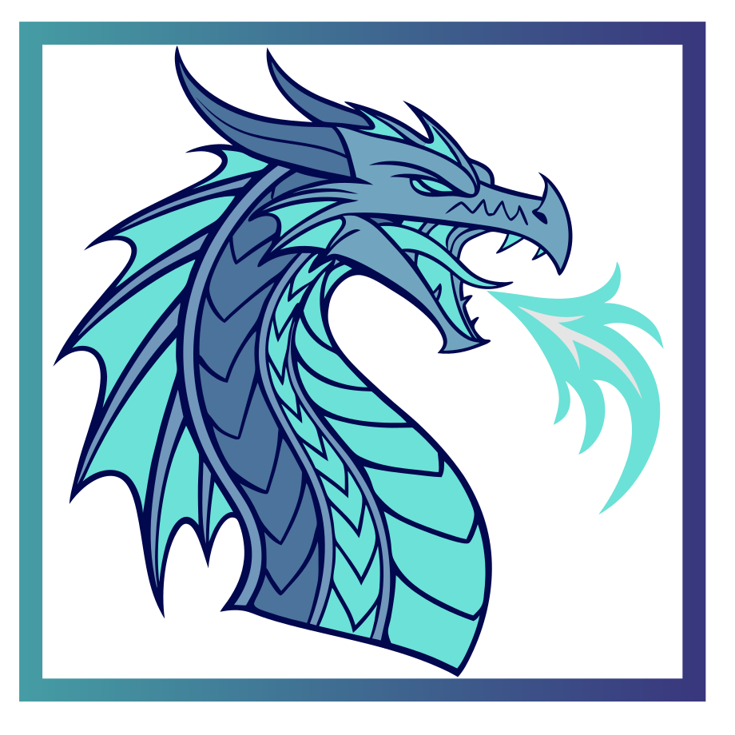

 
 

  

 

  

  <picture>
    <source media="(prefers-color-scheme: dark)" srcset="../assets/tagline-dark.png">
    <source media="(prefers-color-scheme: light)" srcset="../assets/tagline-light.png">
    
  </picture>

 

  <a href="https://scramdb.com"><picture><source media="(prefers-color-scheme: dark)" srcset="../assets/btn-product-dark.png"></picture></a><picture><source media="(prefers-color-scheme: dark)" srcset="../assets/btn-separator-dark.svg"></picture><a href="https://scramdb.com/docs/getting-started"><picture><source media="(prefers-color-scheme: dark)" srcset="../assets/btn-docs-dark.png"></picture></a><picture><source media="(prefers-color-scheme: dark)" srcset="../assets/btn-separator-dark.svg"></picture><a href="https://github.com/scramdblabs/issues"><picture><source media="(prefers-color-scheme: dark)" srcset="../assets/btn-issues-dark.png"></picture></a>

  <a href="https://scramdb.com/docs/deployment/single-node"><picture><source media="(prefers-color-scheme: dark)" srcset="../assets/btn-single-node-dark.png"></picture></a><picture><source media="(prefers-color-scheme: dark)" srcset="../assets/btn-separator-dark.svg"></picture><a href="https://github.com/scramdblabs/charts"><picture><source media="(prefers-color-scheme: dark)" srcset="../assets/btn-cluster-dark.png"></picture></a><picture><source media="(prefers-color-scheme: dark)" srcset="../assets/btn-separator-dark.svg"></picture><a href="https://discord.gg/wuaUpxCqxg"><picture><source media="(prefers-color-scheme: dark)" srcset="../assets/btn-discord-dark.png"></picture></a>

  

 

  <picture>
    <source media="(prefers-color-scheme: dark)" srcset="../assets/tagline-join-dark.png">
    <source media="(prefers-color-scheme: light)" srcset="../assets/tagline-join-light.png">
    
  </picture>

  <a href="https://x.com/ScramDB"><picture><source media="(prefers-color-scheme: dark)" srcset="../assets/social-x-dark.png"></picture></a><a href="https://www.linkedin.com/company/scramdb"><picture><source media="(prefers-color-scheme: dark)" srcset="../assets/social-linkedin-dark.png"></picture></a><a href="https://github.com/scramdblabs"><picture><source media="(prefers-color-scheme: dark)" srcset="../assets/social-github-dark.png"></picture></a><a href="https://www.youtube.com/@ScramDB"><picture><source media="(prefers-color-scheme: dark)" srcset="../assets/social-youtube-dark.png"></picture></a><a href="https://bsky.app/profile/scramdb.bsky.social"><picture><source media="(prefers-color-scheme: dark)" srcset="../assets/social-bluesky-dark.png"></picture></a><a href="https://www.instagram.com/scramdb"><picture><source media="(prefers-color-scheme: dark)" srcset="../assets/social-instagram-dark.png"></picture></a><a href="https://discord.gg/wuaUpxCqxg"><picture><source media="(prefers-color-scheme: dark)" srcset="../assets/social-discord-dark.png"></picture></a>

 

  Enterprise and trial licensing: <a href="mailto:info@scramdb.com">info@scramdb.com</a>

